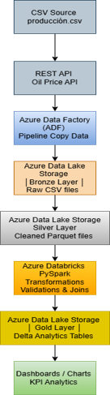

# pipeline-medallion-azure
Pipeline de datos con Azure Data Factory y Databricks. Arquitectura Medallion (Bronze / Silver / Gold)
# Pipeline de Datos — Arquitectura Medallion en Azure

## Descripción del proyecto

Este proyecto implementa un pipeline de ingeniería de datos orientado al análisis de producción petrolera mundial utilizando servicios cloud de Microsoft Azure. 

El pipeline ingiere datos históricos desde archivos CSV y los enriquece con información obtenida desde una API REST de precios internacionales del petróleo. La solución aplica una arquitectura Medallion (Bronze, Silver y Gold) para procesar, validar y transformar los datos hasta generar información analítica lista para visualización.

## Tecnologías utilizadas

- **Azure Data Lake Storage Gen2** — almacenamiento de archivos fuente y capas Bronze/Silver/Gold
- **Azure Data Factory** — orquestación y automatización del pipeline
- **Azure Databricks** — transformación y procesamiento distribuido
- **Delta Lake** — formato de almacenamiento con soporte ACID
- **PySpark** — procesamiento de datos a escala
- **REST API** — obtención de precios actualizados del petróleo

## Arquitectura

El pipeline implementa la arquitectura Medallion de tres capas:

| Capa | Descripción |
|------|-------------|
| 🟤 Bronze | Ingesta de datos crudos desde CSV. Sin transformaciones. |
| ⚪ Silver | Limpieza, validación de calidad, tipado de columnas y transformación a formato Parquet. |
| 🟡 Gold | Datos analíticos enriquecidos con información de precios del petróleo y métricas agregadas. |

